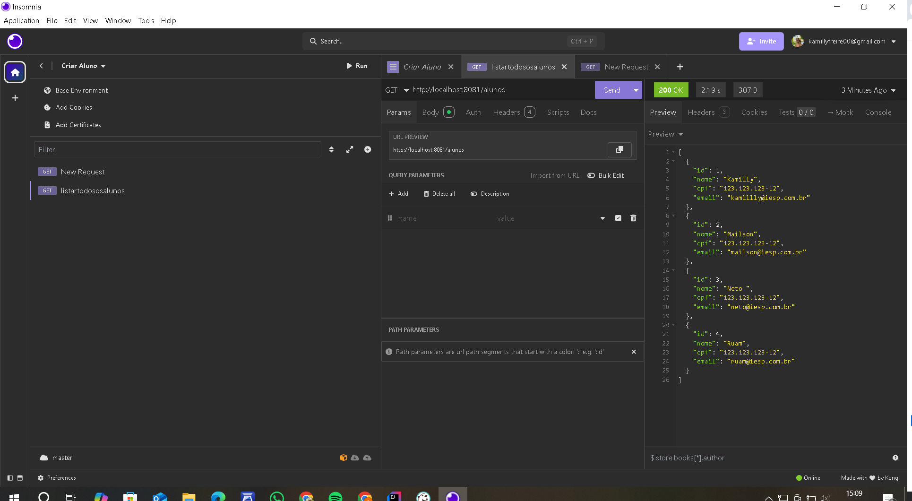
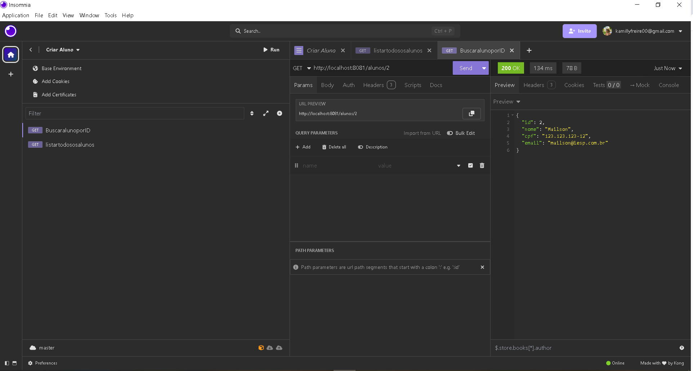
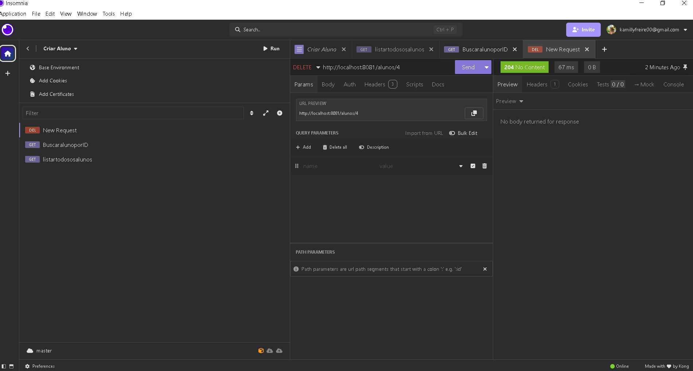

# 🚀 API-SUPER

Este projeto é uma API REST desenvolvida com **Spring Boot** para o gerenciamento de uma instituição de ensino, permitindo o controle de **alunos, professores, disciplinas, matrículas, notas e históricos escolares**.

---

## 🔧 Tecnologias Utilizadas

- ☕ Java 17
- 🚀 Spring Boot
- 🗄️ Spring Data JPA
- 🐘 PostgreSQL
- 📑 Swagger (OpenAPI)
- ⚙️ Maven
- 💻 IntelliJ IDEA
- 🔗 Insomnia (para testes de API)

---

## 🗂️ Estrutura do Projeto

src/
└── main/
└── java/
└── br.com.alunoonline.api/
├── config/
├── controller/
├── dto/
├── enums/
├── model/
├── repository/
├── service/
└── resources/
├── application.properties
├── static/
├── templates/

---

## ⚙️ Funcionalidades da API

- ✅ CRUD de Alunos
- ✅ CRUD de Professores
- ✅ CRUD de Disciplinas
- 🎯 Matrícula de Alunos nas Disciplinas
- ✍️ Lançamento e Atualização de Notas
- 🗒️ Geração de Histórico Escolar
- 🔗 Documentação interativa com Swagger UI

---

## 📄 Documentação da API

Após rodar o projeto, acesse a documentação no navegador:

👉 [http://localhost:8080/swagger-ui/index.html](http://localhost:8080/swagger-ui/index.html)

---

## 🧪 Testes no Insomnia

- O arquivo de testes está incluído na raiz do projeto com o nome:  
  `Insomnia_2025-06-03.har`

> ✅ Para testar, basta importar este arquivo no **Insomnia** e executar todos os endpoints diretamente.

### ✔️ Como importar no Insomnia:

1. Abra o Insomnia.
2. Clique em **“Arquivo” → “Importar” → “Arquivo”**.
3. Selecione o arquivo `Insomnia_2025-06-04.har`.
4. Pronto! Todos os endpoints estarão prontos para testar.

---

## 🗄️ Banco de Dados (PostgreSQL)

- Dump do banco de dados incluído na raiz do projeto:  
  `dump-aluno_online_casa-202506041647.sql`

> ✅ Pode ser restaurado no PostgreSQL para ter acesso às tabelas e dados.

---

## 🚀 Como Executar o Projeto Localmente

### 🔽 Pré-requisitos:

- Ter instalado:
    - Java 17
    - PostgreSQL
    - Maven
    - IntelliJ IDEA ou outra IDE
    - Insomnia (opcional para testes)

### 💻 Passos:

1. **Clone o repositório:**
```bash
git clone https://github.com/kamillyfreire00/API-SUPER.git
````
#Projeto de Backend do Professor Kelson

Banco de dados Listar todos os alunos


Insomnia - Listar todos os alunos


Insomnia - Buscar aluno pelo Ip


Insomnia - Deletar aluno


Banco de dados apos o delete no Insomnia


Banco de Dados com Swaguer Matricula Trancado 


Banco de Dados Completo 
